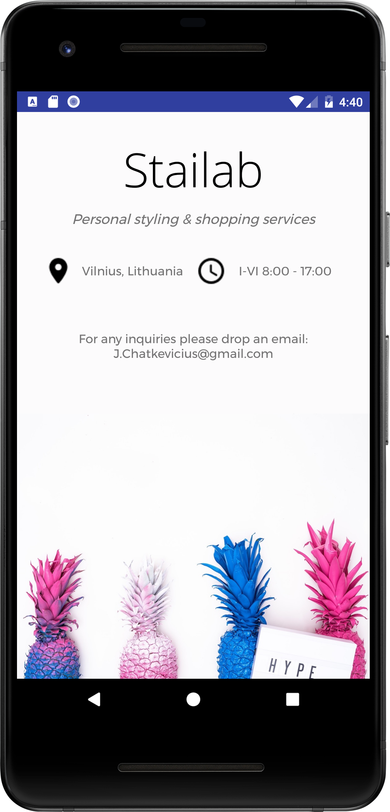

# Android Business Card app
Business Card app for Udacity Android Basics Nanodegree by Google 

# Description
Designed and implemented a single screen app that displays information about a fictional small business. 

# Requirements
- Layout scales responsively for screen sizes in portrait mode, with no part of any images only partially visible.
- ConstraintLayout

# Screenshot

